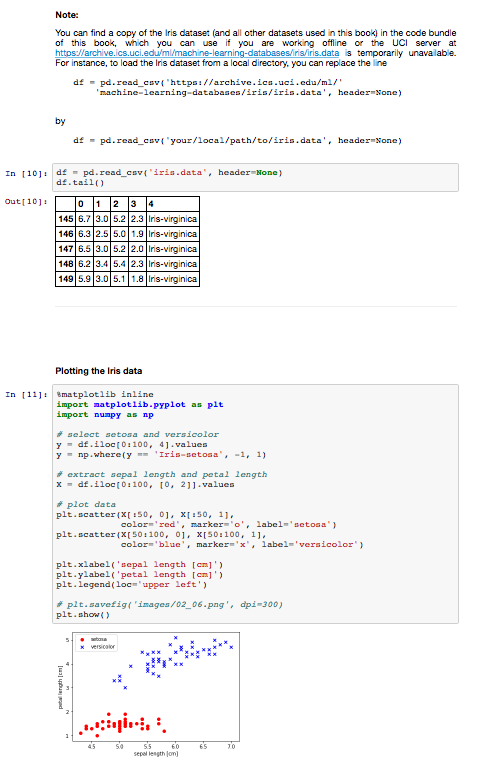

머신 러닝 교과서 2판

## 15장 - 심층 합성곱 신경망으로 이미지 분류

### 목차

- 합성곱 신경망의 구성 요소
    - CNN과 특성 계층 학습
    - 이산 합성곱 수행
        - 1차원 이산 합성곱 수행
        - 출력 특성 맵의 크기를 조절하기 위해 입력에 패딩하기
        - 합성곱 출력 크기 계산
        - 2D 이산 합성곱 수행
    - 서브샘플링
- 기본 구성 요소를 사용하여 심층 합성곱 신경망 구성
    - 여러 개의 입력 또는 컬러 채널 다루기
    - 드롭아웃으로 신경망 규제
    - 분류를 위한 손실 함수
- 텐서플로를 사용하여 심층 합성곱 신경망 구현
    - 다층 CNN 구조
    - 데이터 적재와 전처리
    - 텐서플로 케라스 API를 사용해 CNN 구현하기
        - 케라스에서 CNN 층 설정하기
        - 케라스로 CNN 구성하기
- CNN을 사용해 얼굴 이미지의 성별 분류하기
    - CelebA 데이터셋 로드하기
    - 이미지 변환과 데이터 증식
    - CNN 성별 분류기 훈련
- 요약

### 코드 사용 방법 안내

이 책의 코드를 사용하는 가장 좋은 방법은 주피터 노트북(`.ipynb` 파일)입니다. 주피터 노트북을 사용하면 단계적으로 코드를 실행하고 하나의 문서에 편리하게 (그림과 이미지를 포함해) 모든 출력을 저장할 수 있습니다.

주피터 노트북은 매우 간단하게 설치할 수 있습니다. 아나콘다 파이썬 배포판을 사용한다면 터미널에서 다음 명령을 실행하여 주피터 노트북을 설치할 수 있습니다:

    conda install jupyter notebook

다음 명령으로 주피터 노트북을 실행합니다.

    jupyter notebook

브라우저에서 윈도우가 열리면 원하는 `.ipynb`가 들어 있는 디렉토리로 이동할 수 있습니다.

**설치와 설정에 관한 더 자세한 내용은 1장의 [README.md 파일](../ch01/README.md)에 있습니다.**

**(주피터 노트북을 설치하지 않았더라도 깃허브에서 [`ch15_part1.ipynb`](https://github.com/rickiepark/python-machine-learning-book-3rd-edition/blob/master/ch15/ch15_part1.ipynb)과 [`ch15_part2.ipynb`](https://github.com/rickiepark/python-machine-learning-book-3rd-edition/blob/master/ch15/ch15_part2.ipynb)을 클릭해 노트북 파일을 볼 수 있습니다.)**.

코드 예제 외에도 주피터 노트북에는 책의 내용에 맞는 섹션 제목을 함께 실었습니다. 또한 주피터 노트북에 원본 이미지와 그림을 포함시켰기 때문에 책을 읽으면서 코드를 쉽게 따라할 수 있으면 좋겠습니다.

